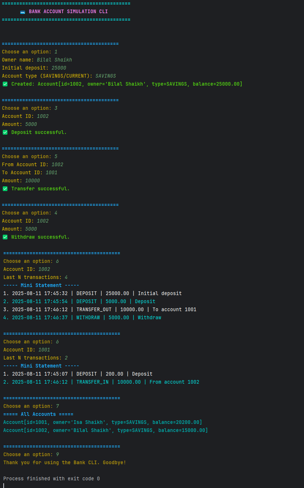

# 💳 Bank Account Simulation CLI

A sleek and interactive **Command-Line Interface (CLI)** banking application built with Java.  
Designed for speed (**O(1)** lookups), scalability, and a professional user experience using **ANSI colors** for an attractive terminal interface.

---

## ✨ Features

- **Create Accounts** – Savings or Current
- **Deposit & Withdraw** with instant balance updates
- **Fund Transfer** between accounts
- **Mini-Statement** showing last N transactions
- **Apply Interest** to savings accounts
- **List All Accounts** in a colorful tabular format
- Preloaded **sample accounts** for quick testing
- Fully menu-driven CLI — no GUI needed

---

## 📂 Project Structure

```aiignore
Bank-Account-CLI/
├── README.md
├── .gitignore
├── images/
│ └── output.png
├── src/
│ ├── Main.java
│ ├── model/
│ │ ├── Account.java
│ │ └── Transaction.java
│ ├── service/
│ │ └── Bank.java
│ └── util/
│ └── ConsoleColors.java
```


---

## 🖥 How to Run

**Open as Java Project**
   ```bash
   "Run Main.java after opening project as IntelliJ project"
   ```
   
---
## 📜 Sample Menu (CLI Output)
````
=========== BANK MENU ===========
1. Create Account
2. View Account
3. Deposit
4. Withdraw
5. Transfer
6. Mini-Statement
7. List All Accounts
8. Apply Interest
9. Exit

 ````
! The menu is shown separately here to keep the output concise and easy to follow. !

---
## 📸 Example Output
Below is an example of the CLI in action (with ANSI colors):

---
## 🔮 Future Enhancements

I am open to suggestions and plan to continue developing this platform.

---

## 🤝 Contact

### 🧑‍💻 Isa Shaikh - [isashaikh2005@gmail.com](mailto:isashaikh2005@gmail.com)

### 🔗Project Link: [https://github.com/IsaShaikh/smartedu-platform](https://github.com/IsaShaikh/Bank-Account-CLI)